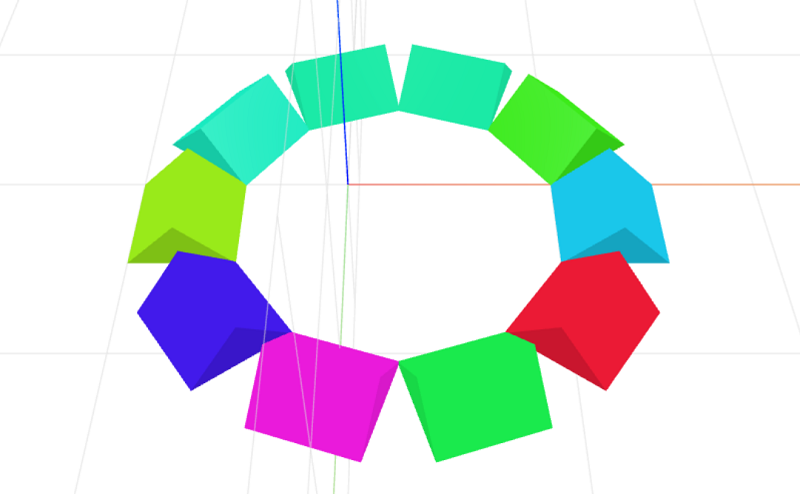

# star-layout
Parameterized star layout for CraftML by doubleshow

### Usage
```html
<craft>
    <craft name="star-layout" module="star-layout"/>
</craft>
```

### Parameters
- radius: adjusts radius of item arrangement
    - default: 10

### Example
```html
<craft>
    <craft name="star-layout" module="star-layout"/>
    <repeat n="10">
        <prism transform="scale(0.5)"></cube>
    </repeat>
</craft>
```



